# KinLab — Architectural Review v0.7 (pre-Day-8)

> Generated: 2026-05-26  
> Test coverage: **494 / 494** · 21 test files · Stack: React 18 · TypeScript 5 · Vite 5 · Vitest 2 · HTML5 Canvas

---

## 1. System Layers

```
┌──────────────────────────────────────────────────────────────────────┐
│  React UI  (App.tsx + components/)                                   │
│  ControlBar · AxisSelector · GravitySlider · DataTable · ScaleControl│
├──────────────────────────────────────────────────────────────────────┤
│  Canvas Layer  (canvas/)                                             │
│  WorldCanvas.tsx  ←rAF 60fps→    GraphCanvas.tsx ←setInterval 30fps→│
├────────────────────────────┬─────────────────────────────────────────┤
│  Engine Layer (engine/)    │  Data Layer (recorder/)                 │
│  World · Body              │  DataRecorder                           │
│  InteractionLayer          │                                         │
│  PhysicsEvents (bus)       │                                         │
├────────────────────────────┼─────────────────────────────────────────┤
│  Graph Layer (graph/)      │  Units Layer (units/)                   │
│  GraphEngine               │  PhysicsScale + presets                 │
├────────────────────────────┴─────────────────────────────────────────┤
│  Foundation                                                          │
│  constants.ts · types/index.ts · utils/math.ts · utils/fps.ts       │
└──────────────────────────────────────────────────────────────────────┘
```

**Key invariant:** Physics engine is the *single source of truth*. It always runs in pixel coordinates. Every other layer is a pure display/export adapter.

---

## 2. UML Class Diagram (Mermaid)

```mermaid
classDiagram
    %% ─── Foundation ─────────────────────────────────────────────────
    class Body {
        +x: number
        +y: number
        +vx: number
        +vy: number
        +ax: number
        +ay: number
    }
    note for Body "Value Object pattern\nMutable data model —\nno behaviour"

    class PhysicsEvent {
        +type: PhysicsEventType
        +bodyIndex: number
        +time: number
        +x?: number
        +y?: number
        +vx?: number
        +vy?: number
    }
    note for PhysicsEvent "Value Object pattern\nImmutable event payload"

    %% ─── Engine Layer ────────────────────────────────────────────────
    class World {
        +bodies: Body[]
        +time: number
        +gravity: number
        +addBody(b: Body): Body
        +step(dt: number): void
        -DAMPING: 0.7
        -FRICTION: 0.85
        -VELOCITY_CLAMP: 0.2
        -MAX_DT: 0.016
    }
    note for World "Facade pattern\nHides Euler integration,\ncollision detection and\nresting logic behind step()"

    class InteractionLayer {
        -dragging: Body | null
        -paused: boolean
        +startDrag(b: Body): void
        +updateDrag(x, y): void
        +endDrag(): void
        +pause(): void
        +resume(): void
        +isPaused(): boolean
        +isDragging(): boolean
    }
    note for InteractionLayer "State pattern\nManages discrete drag\nand pause states"

    class PhysicsEventBus {
        -handlers: Map~type, Set~handler~~
        +on(type, handler): void
        +off(type, handler): void
        +emit(event): void
        +clear(type?): void
        +listenerCount(type): number
        +hasListeners(type): boolean
    }
    note for PhysicsEventBus "Observer / Pub-Sub pattern\nDecouples physics events\nfrom UI components"

    %% ─── Data Layer ──────────────────────────────────────────────────
    class DataRecorder {
        -recording: boolean
        -data: Record~SeriesKey, number[]~
        +start(): void
        +stop(): void
        +reset(): void
        +record(t,x,y,vx,vy,ax,ay): void
        +getSeries(key): number[]
        +getLength(): number
        +isRecording(): boolean
    }
    note for DataRecorder "Repository pattern\nStores 7-series time-series\ndata; returns defensive copies"

    %% ─── Graph Layer ─────────────────────────────────────────────────
    class GraphEngine {
        -ctx: CanvasRenderingContext2D | null
        -w: number
        -h: number
        +draw(rec, xKey, yKey, flipY, scale): void
        -drawGrid(ctx): void
        -drawAxes(ctx, xLabel, yLabel, ...): void
        -drawData(ctx, xs, ys, ...): void
    }
    note for GraphEngine "Template Method pattern\ndraw() = drawGrid → drawAxes\n         → drawData\nDirty-flag caller (GraphCanvas)"

    %% ─── Units Layer ─────────────────────────────────────────────────
    class PhysicsScale {
        +id: UnitId
        +pixelsPerUnit: number
        +unitSymbol: string
        +name: string
        +metersPerUnit: number | null
    }
    note for PhysicsScale "Strategy pattern\n4 interchangeable strategies:\npx / cm / m / custom\nEngine always stays in px"

    %% ─── Utils ───────────────────────────────────────────────────────
    class FpsMeter {
        -samples: number[]
        -lastTime: number | undefined
        -maxSamples: number
        +tick(now?): void
        +fps: number
        +min: number
        +max: number
        +reset(): void
    }
    note for FpsMeter "Rolling window pattern\nFixed-size circular buffer\nfor FPS averaging"

    class MathUtils {
        +clamp(v, min, max): number
        +lerp(a, b, t): number
        +roundTo(v, d): number
        +kineticEnergy(vx, vy, m?): number
        +potentialEnergy(h, m?, g?): number
        +mechanicalEnergy(vx,vy,h,m?,g?): number
        +mapRange(v, i0, i1, o0, o1): number
    }
    note for MathUtils "Pure Functions module\nNo state, no side effects\nSafe in engine hot path"

    %% ─── Canvas Layer ────────────────────────────────────────────────
    class WorldCanvas {
        -canvasRef: Ref~HTMLCanvasElement~
        -rafIdRef: Ref~number~
        -lastTsRef: Ref~number | undefined~
        +render(): JSX.Element
        -rafLoop(ts): void
    }
    note for WorldCanvas "Template Method + rAF loop\nuseEffect: setup → tick →\ncancelAnimationFrame cleanup\nModule singletons: no re-init"

    class GraphCanvas {
        -canvasRef: Ref~HTMLCanvasElement~
        -engineRef: Ref~GraphEngine | null~
        -lastLenRef: Ref~number~
        +render(): JSX.Element
    }
    note for GraphCanvas "Dirty Flag pattern\nsetInterval(32ms):\nskips draw when getLength\n== lastLenRef.current"

    %% ─── App (Singletons) ────────────────────────────────────────────
    class App {
        +world: World$
        +recorder: DataRecorder$
        +interaction: InteractionLayer$
        -xKey: SeriesKey
        -yKey: SeriesKey
        -flipY: boolean
        -gravity: number
        -scale: PhysicsScale
    }
    note for App "Module-level Singleton\nworld/recorder/interaction\ncreated outside component\n→ stable rAF closure"

    %% ─── Relationships ───────────────────────────────────────────────
    World "1" --> "0..*" Body : contains
    World --> InteractionLayer : checked by WorldCanvas
    WorldCanvas --> World : step(dt)
    WorldCanvas --> DataRecorder : record(...)
    WorldCanvas --> InteractionLayer : isDragging / pause
    WorldCanvas --> FpsMeter : tick()
    GraphCanvas --> GraphEngine : draw(rec, xKey, yKey)
    GraphCanvas --> DataRecorder : getLength() dirty check
    GraphEngine --> DataRecorder : getSeries(key)
    GraphEngine --> PhysicsScale : axisLabel / ppu
    PhysicsEventBus --> PhysicsEvent : emits
    App --> World : owns (singleton)
    App --> DataRecorder : owns (singleton)
    App --> InteractionLayer : owns (singleton)
    App --> WorldCanvas : renders
    App --> GraphCanvas : renders
    App --> PhysicsScale : state (active strategy)
```



---

## 3. Data Flow Diagram

```
  User Input                    Physics Layer              Data Layer
  ──────────                    ─────────────              ──────────
  ControlBar.Play()
       │ recorder.start()
       │ world.reset()
       ↓
  WorldCanvas.rAF(ts)
       │ dt = min((ts-last)/1000, 0.016)   ← dt-cap (T6.1)
       │
       ├──[not dragging]──→ world.step(dt)
       │                         │
       │                         ├─ Euler: vy += g*dt, y += vy*dt
       │                         ├─ Floor collision: vy = -vy*0.7
       │                         └─ Wall collision: vx = -vx*0.8
       │
       ├──────────────────→ recorder.record(t, x, y_phys, vx, -vy, ax, -ay)
       │                    (physical coords: y_phys = FLOOR_Y - canvas_y)
       │
       └──────────────────→ draw(canvas, ball, arrow, floor, ruler)

  GraphCanvas.setInterval(32ms)
       │ currentLen = recorder.getLength()
       │ if (currentLen == lastLen) return     ← Dirty Flag (T7.3)
       └──→ graphEngine.draw(recorder, xKey, yKey, flipY, scale)
                  │
                  ├─ getSeries(xKey) → raw px values
                  ├─ getSeries(yKey) → raw px values
                  ├─ flipY? negate Y
                  ├─ ppu≠1? divide by pixelsPerUnit   ← Strategy (scale)
                  └─ drawGrid → drawAxes → drawData   ← Template Method
```

---

## 4. Design Patterns Catalogue

| # | Pattern | Where | Why |
|---|---------|--------|-----|
| 1 | **Facade** | `World.step()` | Hides Euler integration, 3-wall collision checks, velocity clamping, resting detection — callers just call `step(dt)` |
| 2 | **Observer / Pub-Sub** | `PhysicsEventBus` | `on/off/emit` — UI panels subscribe to `floor-bounce`, `wall-bounce`, `rest`, `step` without coupling to World internals |
| 3 | **Strategy** | `PhysicsScale` + `SCALE_PRESETS` | 4 interchangeable unit strategies (px/cm/m/custom) plug into GraphEngine, DataTable, CSV, GravitySlider — engine untouched |
| 4 | **Module-level Singleton** | `App.tsx` top-level `world/recorder/interaction` | Stable references survive React re-renders; rAF closure captures them once at mount |
| 5 | **Dirty Flag** | `GraphCanvas.lastLenRef` | `setInterval` poll skips `draw()` when recorder length unchanged → zero wasted renders at idle |
| 6 | **Repository** | `DataRecorder` | Single store for 7 time-series; `getSeries(key)` returns defensive copies; start/stop/reset lifecycle |
| 7 | **Template Method** | `GraphEngine.draw()` | Fixed skeleton: `drawGrid → drawAxes → drawData`; subclass-like overrides via parameters (flipY, scale) |
| 8 | **Template Method** | `WorldCanvas.useEffect` rAF loop | Fixed structure: setup (create loop) → body (step+record+draw) → teardown (cancelAnimationFrame) |
| 9 | **Value Object** | `Body`, `PhysicsEvent`, `PhysicsScale` | Carry data without identity; `PhysicsScale` is immutable (readonly), `Body` is intentionally mutable (engine writes it) |
| 10 | **Factory Function** | `makeCustomScale()` | Produces validated `PhysicsScale` objects with clamped `pixelsPerUnit ≥ 0.001` |
| 11 | **State** | `InteractionLayer` | Manages two orthogonal boolean states: `paused` + `dragging`; explicit transitions via named methods |
| 12 | **Rolling Window** | `FpsMeter` | Fixed-capacity array with `shift()` eviction; `fps` getter computes rolling average over last N samples |

---

## 5. Module Dependency Graph

```
App.tsx
 ├── engine/           (World, Body, InteractionLayer) ← no deps on UI
 │     └── constants.ts
 ├── recorder/         (DataRecorder)                  ← no deps on UI
 ├── canvas/
 │     ├── WorldCanvas.tsx  ← engine + recorder + units + utils
 │     └── GraphCanvas.tsx  ← recorder + graph + units
 ├── graph/
 │     └── GraphEngine.ts   ← recorder + units
 ├── units/
 │     └── PhysicsScale.ts  ← recorder (SeriesKey only)
 ├── utils/
 │     ├── math.ts          ← zero deps
 │     └── fps.ts           ← zero deps
 ├── types/
 │     └── index.ts         ← zero deps (pure types)
 └── components/
       ├── ControlBar.tsx   ← engine + recorder
       ├── GravitySlider.tsx← units
       ├── AxisSelector.tsx ← recorder + units
       ├── DataTable.tsx    ← recorder + units
       ├── CsvExportButton  ← recorder + units
       ├── ScaleControl.tsx ← units
       └── Day6Panel.tsx    ← engine + recorder + units + utils
```

**Dependency direction rules (enforced):**
- Engine layer has **zero** UI dependencies
- Recorder has **zero** UI dependencies
- Math utils have **zero** dependencies
- Units layer depends only on `SeriesKey` type — no engine state
- UI flows *inward* (components → canvas → engine/recorder)

---

## 6. Key Constants (Physics Source of Truth)

```typescript
// src/constants.ts
FLOOR_Y      = 500   // px — floor collision boundary
CANVAS_W     = 600   // px
CANVAS_H     = 520   // px (20px below floor for visual margin)
BALL_RADIUS  = 20    // px
GRAVITY      = 9.8   // px/s²  (visual scale, not SI)
WALL_L       = 20    // px (= BALL_RADIUS)
WALL_R       = 580   // px (= CANVAS_W - BALL_RADIUS)
WALL_DAMPING = 0.8   // energy retained per wall bounce

// src/engine/World.ts (internal)
DAMPING        = 0.7    // floor bounce energy retention
FRICTION       = 0.85   // floor horizontal friction
VELOCITY_CLAMP = 0.2    // > GRAVITY*MAX_DT (9.8*0.016=0.157) — prevents infinite micro-bounce
MAX_DT         = 0.016  // 60fps cap — prevents time-jump when tab hidden
```

---

## 7. Coordinate Convention

```
Canvas coords (engine internal):         Physical coords (DataRecorder stores):
   (0,0) ──────────────→ x                 (0, FLOOR_Y) = floor origin
     │                                      y_phys = FLOOR_Y - canvas_y
     │  y increases DOWN                    y_phys increases UP  ↑+
     ↓
  FLOOR_Y = 500px                         Ball at canvas y=50  → y_phys=450
                                           Ball at canvas y=500 → y_phys=0
```

---

## 8. Day 8 Preparation Checklist

All existing code is verified against Day 8 (KAN-16) requirements:

| KAN-16 Task | Status | Existing impl |
|---|---|---|
| T8.1 Mouse events in WorldCanvas (mousedown/move/up) | ✅ Implemented | `WorldCanvas.tsx` uses `InteractionLayer.startDrag/updateDrag/endDrag` |
| T8.2 ControlBar.tsx (Play/Pause/Reset) | ✅ Implemented | `components/ControlBar.tsx` |
| T8.3 ControlBar in App.tsx above WorldCanvas | ✅ Implemented | `App.tsx` line 121 |
| T8.4 Git commit | ✅ Done | Committed in previous sessions |

**Day 8 is already fully implemented.** Day 8 tests should verify the KAN-16 gate:
- UC-1: drop/bounce ✓
- UC-2: pause/resume ✓  
- UC-3: drag repositions ball ✓
- UC-4: Play click starts recording ✓
